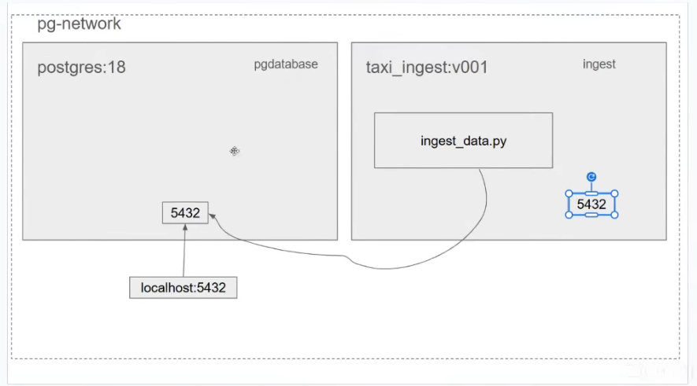

# docker-workshop-zoomcamp
Workshop from De Zoomcamp

Note: 

- using UV --dev for adding lib when only need that lib for dev
- using click with uv python for adding parameters
- for connect the container ingest with the pgdatabase containter, we need to create a network:
    `docker network create pg-network`
    
- docker compose create the pipeline_default network since we did not mentioned the name so it is the combination of folder file and default
    docker network ls
NETWORK ID     NAME               DRIVER    SCOPE
256869c34491   bridge             bridge    local
84121fd13711   host               host      local
9e230f819953   none               null      local
01236c3defe4   pg-network         bridge    local
e3a4273a82e8   pipeline_default   bridge    local